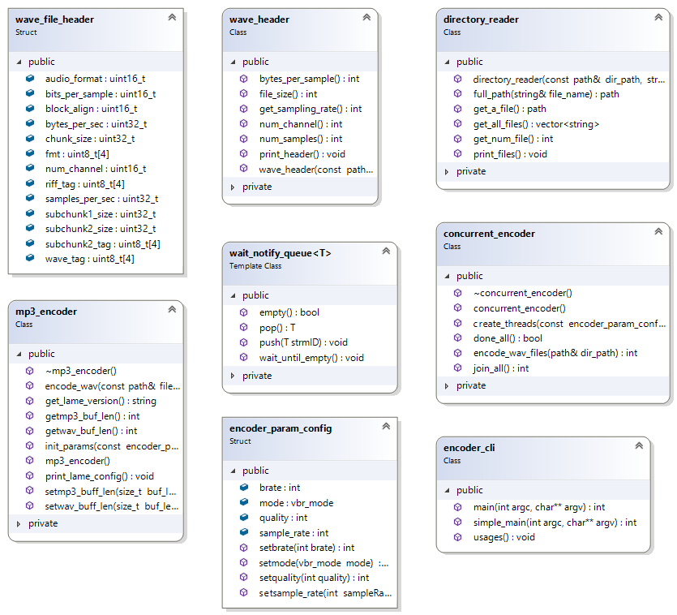

# mp3_encoder
Multi-threaded  MP3 encoder which read all the files from a given directory and encodes them into mp3. It uses [lame](https://sourceforge.net/projects/lame/).  
### Setup  Lame Dependency
**Linux**
1. sh setup_lame.sh : Gets the zip, build and install the files in ext directory, 
2. sh setup_lame.sh clean : to remove setup files i.e lame folders etc.

**mingw console (window)**
1. sh setup_lame_win.sh : Gets the zip, build and install the files in ext directory, 
2. sh setup_lame_win.sh clean : Removes lame related files files


### Build and Test
1. make : Creates two binary encode, encode_test
2. ./encode /path_to_dir/ : CLI program
3. ./encode_test : run tests on classes

### Control Variable
1. LOG_VERBOSE : Enable logging  
2. TEST_REPORT_LOG : Generate test report 


### Major Class Description

1. `directory_reader` : Reads all the  files with extension (default .wav) from a given directory,  throws exception if path is invalid.  
2. `wave_file_header` : Wav/RIFF file format header info representation.  
3. `wave_header` :  Read header info from a wave file and abstracts parameter access.  
4. `mp3_encoder` : Encode a wav file into mp3, wrap around lame calls as RAII.  
5. `encoder_param_config` : Parameter for lame encoder configuration.  
6. `wait_notify_queue` : A thread safe queue to hold a type T. Pop waits if queue is empty and push notify the waiting threads.   
7. `concurrent_encoder` : Encode all the wave in the directory using user configured number of thread.    
8. `encoder_cli` : Handles command line based input for concurrent_encoder   



### CLI  Logs
```
/proj_path/mp3_encoder%./encode  
./encode [options] directory_path  
 Options  
  thread      <n> : number of thread to execute
  brate       <n> : bit rate for encoder
  sample_rate <n> : sample rate for encoder
  quality     <n> : quality for encoder
/proj_path/mp3_encoder% ./encode /proj_path/mp3_encoder
 Encoded 0 wav files to mp3 from directory "/proj_path/mp3_encoder"
/proj_path/mp3_encoder% ./encode /proj_path/mp3_encoder/test_data/
 Encoded 4 wav files to mp3 from directory "/proj_path/mp3_encoder/test_data/"
/proj_path/mp3_encoder% ./encode --thread 5 /proj_path/mp3_encoder/test_data/
 Incorrect options
./encode [options] directory_path
 Options
  thread      <n> : number of thread to execute
  brate       <n> : bit rate for encoder
  sample_rate <n> : sample rate for encoder
  quality     <n> : quality for encoder
/proj_path/mp3_encoder% ./encode thread 5 /proj_path/mp3_encoder/test_data/
 Encoded 4 wav files to mp3 from directory "/proj_path/mp3_encoder/test_data/"
/proj_path/mp3_encoder% ./encode thread 5 brate 128 /proj_path/mp3_encoder/test_data/
 Encoded 4 wav files to mp3 from directory "/proj_path/mp3_encoder/test_data/"
```
### CLI Test Logs
```
/proj_path/mp3_encoder% ./encode_test
 Running Test for encoder
1 : void test_directory_reader::tc0() Passed
2 : void test_directory_reader::tc1() Passed
3 : void test_directory_reader::tc2() Passed
4 : void test_directory_reader::tc3() Passed
5 : void test_directory_reader::tc4() Passed
6 : void test_wave_header::tc0() Passed
7 : void test_wave_header::tc1() Passed
8 : void test_wave_header::tc2() Passed
9 : void test_wave_header::tc3() Passed
10 : void test_mp3_encoder::tc0() Passed
11 : void test_mp3_encoder::tc1() Passed
12 : void test_mp3_encoder::tc2() Passed
13 : static int test_mp3_encoder::tc3() Passed
14 : static int test_mp3_encoder::tc4() Passed
15 : void test_wait_notify_que::tc0() Passed
16 : void test_wait_notify_que::tc1() Passed
17 : void test_concurrent_thread::tc0() Passed
18 : void test_concurrent_thread::tc1() Passed
19 : void test_concurrent_thread::tc3() Passed
20 : void test_concurrent_thread::tc4() Passed
No such file or directory
21 : static void test_encoder_cli::tc0() Passed
No such file or directory
22 : static void test_encoder_cli::tc1() Passed

```

